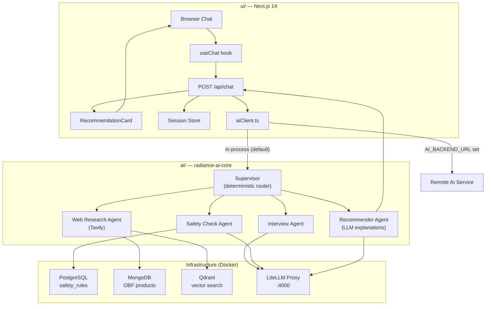
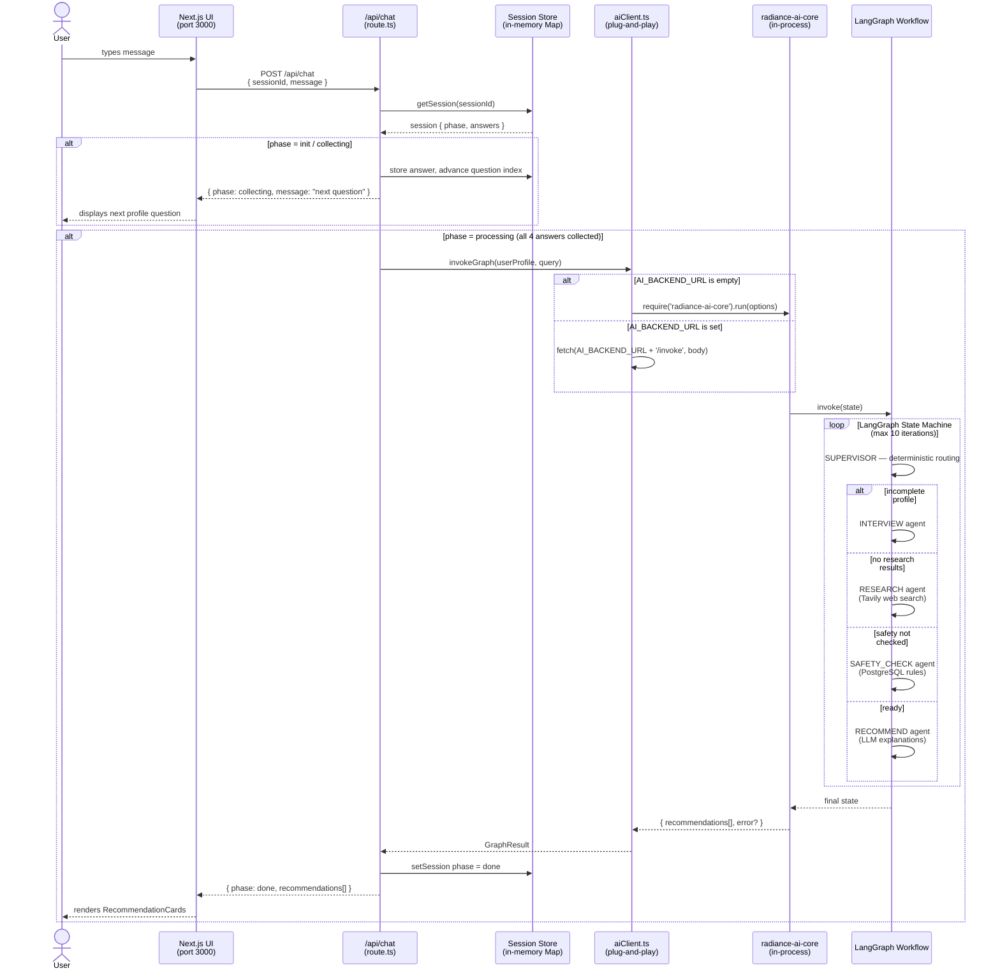

# Radiance AI

A cosmetic product recommendation system powered by a multi-agent LLM workflow. It interviews the user, researches products for their country, validates ingredients against safety rules, and returns ranked recommendations.

## Architecture



All LLM calls route through a **LiteLLM proxy** (port 4000), which abstracts over OpenAI and Anthropic models. Product safety rules are stored in **PostgreSQL 16 + pgvector**.

### Request Flow



---

## Prerequisites

- Node.js 20+
- Docker & Docker Compose
- An OpenAI API key (required); Anthropic API key (optional, for Claude models)

---

## Setup

### 1. Start infrastructure

```bash
export OPENAI_API_KEY=sk-...
export ANTHROPIC_API_KEY=sk-ant-...   # optional

docker-compose -f docker/docker-compose.yml up -d
```

This starts:
- **PostgreSQL 16 + pgvector** on port `5432` (db: `cosmetic_rai`, user/pass: `postgres`)
- **LiteLLM proxy** on port `4000` — automatically applies migrations from `data/migrations/`

### 2. Install dependencies

```bash
cd ai && npm install
cd ../data && npm install
```

### 3. Seed the databases

#### 3.1. Seed products from Open Beauty Facts

```bash
docker compose -f docker/docker-compose.yml --profile seed run --rm obf-seed
```

- Downloads and inserts the latest product dump from openbeautyfacts into mongodb.

#### 3.2. Sync products to Qdrant

```bash
export EMBEDDING_MODEL=...
export EMBEDDING_MODEL_DIMENSIONS=...   

npm run sync -- [# of products]    # Replace [# of products] with how many products to sync
```

#### 3.3. Seed safty rules

```bash
cd data && npm run seed
```

- Inserts ~30 ingredient safety rules (e.g. retinol + pregnancy = critical).

## Running

### Development (auto-restart on file changes)

```bash
cd ai && npm run dev
```

### Production build

```bash
cd ai && npm run build
cd data && npm run build
```

---

## Environment Variables

All variables have defaults suitable for local development.

| Variable | Default | Description |
|----------|---------|-------------|
| `LITELLM_BASE_URL` | `http://localhost:4000/v1` | LiteLLM proxy endpoint |
| `LITELLM_API_KEY` | `sk-litellm-master` | Proxy master key |
| `LLM_MODEL` | `gpt-4o-mini` | Model name as configured in `litellm-config.yaml` |
| `EMBEDDING_MODEL` | `text-embedding-3-small` | Model name as configured in `litellm-config.yaml` |
| `EMBEDDING_MODEL_DIMENSIONS` | `1536` | Model dimensions as configured in `litellm-config.yaml` |
| `DB_HOST` | `localhost` | PostgreSQL host |
| `DB_PORT` | `5432` | PostgreSQL port |
| `DB_NAME` | `cosmetic_rai` | Database name |
| `DB_USER` | `postgres` | Database user |
| `DB_PASSWORD` | `postgres` | Database password |

---

## Testing

```bash
# AI layer tests
cd ai && npm test

# Data layer tests
cd data && npm test

# Single test file
cd ai && npx jest tests/agents/supervisor.test.ts
```

Tests are fully mocked — no live database or LLM calls required.

---

## Available LLM Models

Configured in `docker/litellm-config.yaml`:

| Model name | Provider | API key env var |
|-----------|----------|----------------|
| `gpt-4o-mini` | OpenAI (default) | `OPENAI_API_KEY` |
| `gpt-4o` | OpenAI | `OPENAI_API_KEY` |
| `text-embedding-3-small` | OpenAI | `OPENAI_API_KEY` |
| `claude-3-5-haiku` | Anthropic | `ANTHROPIC_API_KEY` |
| `claude-sonnet-4-5` | Anthropic | `ANTHROPIC_API_KEY` |
| `gemini-2.0-flash` | Google | `GEMINI_API_KEY` |
| `gemini-2.5-pro` | Google | `GEMINI_API_KEY` |
| `gemini-embedding-2` | Google | `GEMINI_API_KEY` |
| `grok-3` | xAI | `XAI_API_KEY` |
| `grok-3-mini` | xAI | `XAI_API_KEY` |
| `groq-llama-3.3-70b` | Groq | `GROQ_API_KEY` |
| `groq-llama-3.1-8b` | Groq | `GROQ_API_KEY` |

Switch models by setting `LLM_MODEL` to any name from the table above. Only the API key for the chosen provider is required.
