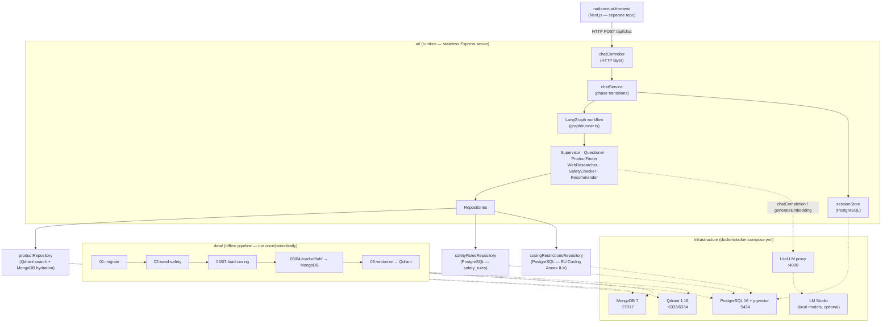

# Architecture Overview — Radiance AI

An agentic recommendation system for cosmetic/skincare products. A multi-agent LangGraph workflow interviews the user, retrieves candidate products from a hybrid catalog, runs a two-layer ingredient safety check, and generates personalised, explained recommendations — served over a stateless REST API with all conversational state persisted in PostgreSQL.

This repo contains two independent packages (`ai/` runtime, `data/` offline pipeline) that share **no code** — enforced at the TypeScript compiler level via `rootDir`. The frontend (`radiance-ai-frontend`, Next.js) lives in a separate repository and talks to `ai/` only via `POST /api/chat`.

---

## System Diagram



---

## Tech Stack

| Layer | Technology | Purpose |
|-------|-----------|---------|
| Runtime API | Express 4 + TypeScript | Stateless HTTP server (`ai/`) |
| Agent orchestration | `@langchain/langgraph` | Deterministic state-machine graph of agent nodes |
| Web search tool | `@langchain/tavily` | Fallback product discovery when catalog search is empty |
| Vector search | Qdrant 1.18 | Cosine-similarity catalog search over product embeddings |
| Product catalog | MongoDB 7 | Raw Open Beauty/Food Facts (OBF/OFF) product documents |
| Relational store | PostgreSQL 16 + pgvector | Session state, conversation history, safety rules, EU CosIng data |
| LLM/embedding gateway | LiteLLM proxy | OpenAI-compatible facade over any provider (OpenAI, Anthropic, Gemini, xAI, Groq, local LM Studio) |
| Schema validation | Zod | Validates every LLM JSON response before use |
| Clinical evidence | PubMed E-utilities (`tools/pubmed/`) | Optional evidence lookup used by the Questioner |
| Testing | Jest + ts-jest | Unit/integration tests for both `ai/` and `data/` |
| Frontend (separate repo) | Next.js | Chat UI — consumes `POST /api/chat` only |

---

## Agent Workflow (LangGraph)


The **Supervisor** (`ai/src/agents/supervisor.ts`) makes no LLM calls — it inspects `GraphStateType` and returns the next `currentStep` with pure, testable TypeScript. Hard cap: 10 iterations, to guarantee termination.

| Node | LLM calls? | Responsibility |
|------|-----------|-----------------|
| `supervisor` | No | Routes to the next node based on graph state |
| `interview` (Questioner) | Yes | Refines the user's issue, collects safety-critical profile fields (country, allergies), optionally queries PubMed for evidence |
| `catalog_search` (ProductFinder) | Yes (embedding only) | Embeds the query, searches Qdrant, hydrates hits from MongoDB |
| `web_search` (WebResearcher) | Yes | Tavily search + LLM extraction of structured product data from raw page content — only runs if the catalog is empty |
| `safety_check` (SafetyChecker) | Yes (Layer 2 only) | Two-layer ingredient safety review (see below) |
| `recommend` (Recommender) | Yes | Ranks safety-checked products, generates personalised explanations + confidence score |

### Safety Checker — two layers

1. **Layer 1 (deterministic)** — `safetyRulesRepository` + `cosingRestrictionsRepository` lookups against the product's INCI/allergen tags and the user's allergies/conditions.
   - EU CosIng **Annex II** match (prohibited substance) or a **critical/high-severity** `safety_rules` violation → **hard block**, final, never seen by Layer 2.
   - EU CosIng **Annex III/IV/V** restriction, a lower-severity violation, sparse ingredient data, or an unrecognized condition → **flagged** for Layer 2.
   - No signal at all → **approved** directly, no LLM call spent.
2. **Layer 2 (LLM, batched)** — reviews only flagged products in a single call, with the user's actual concern/profile as context. Structurally **cannot** escalate to a hard block (the output schema has only `approved`/`soft_warning`). On LLM failure or a name-match miss, defaults to `soft_warning` (favors caution).

Output: `SafetyReport { approved, softWarnings, hardBlocks }`, plus a flattened `safetyCheckedProducts = approved + softWarnings` for the Recommender.

### Recommender — ranking vs. LLM confidence (two independent signals)

- **Ranking** (`rank()` in `recommender.ts`) happens *before* the LLM call: `SAFETY_WEIGHT[safetyStatus] * 0.6 + relevanceScore * 0.4`, where `relevanceScore` is a hardcoded safety-tier proxy set in `safetyChecker.ts` (0 / 0.5 / 0.7 / 0.9 / 1.0) — used only to order the top 5, never shown to the user.
- **`confidence`** is a genuine LLM-self-reported 0–100 signal, generated during the enrichment call, calibrated against ingredient completeness/goal match/safety status, and rendered in the UI as "% match." It is deliberately independent of the ranking formula — display order and confidence value can therefore diverge (documented, not currently reconciled).

---

## Request Lifecycle (`POST /api/chat`)


Sessions are fully stateless between requests: `phase`, `profile`, `questioning`, and conversation history round-trip through PostgreSQL (`user_sessions`, `conversation_history`) via `sessionStore.ts`. Any server instance can resume any in-flight session.

**Request correlation**: `chatController` mints a short `requestId` per HTTP call, propagated through every layer via `AsyncLocalStorage` (`common/requestContext.ts`). `common/logger.ts` patches `console.*` once at startup to prefix every log line with `[req=<id>]`, and the same ID is persisted on the matching `conversation_history` row — so one turn's logs across all layers, or the DB row for a given log line, are always cross-referenceable.

---

## Data Pipeline (`data/`, offline)

One-time/periodic process that prepares the stores `ai/` reads from at runtime. No shared code with `ai/`.

```
01-migrate            → apply data/migrations/*.sql to PostgreSQL, in order
02-seed-safety        → seed safety_rules contraindication table
06-load-cosing-restrictions → EU CosIng Annex III/IV/V → PostgreSQL
07-load-cosing-prohibited   → EU CosIng Annex II → PostgreSQL
04-load-obf            → Open Beauty Facts mongodump → MongoDB (03-load-off exists but is skipped in run-all.ts)
05-vectorize           → embed product text → upsert into Qdrant (auto-recreates collection on dimension mismatch)
```

`data/pipeline/run-all.ts` is the canonical run order; individual steps are also runnable via `npm run pipeline:<step>`.

---

## Design Principles (as implemented)

- **Package isolation** — `ai/` and `data/` share no code; enforced by separate `tsconfig.json` `rootDir` settings, not just convention.
- **Provider abstraction** — every LLM/embedding call goes through `llm/client.ts` / `llm/embeddings.ts` (thin `fetch` wrappers to the LiteLLM proxy). No AI SDK is imported in `ai/`. Swapping providers is an env-var change (`LLM_MODEL` in `ai/.env`, routing in `docker/litellm-config.yaml`).
- **Deterministic supervisor** — all routing logic in `agents/supervisor.ts` is plain TypeScript, no LLM calls, fully unit-testable.
- **Typed error hierarchy** (`common/errors.ts`) — `LlmCallError`, `RepositoryError`, `SchemaParseError` — mapped to generic user-facing messages in `chatService.ts` without leaking internals.
- **Schema-validated LLM output** — every LLM JSON response is parsed through a Zod schema before use; agents fall back to unenriched/cautious results on parse failure rather than propagating a malformed response.
- **Injection-aware prompts** — `QUESTIONER_SYSTEM`, `RECOMMENDER_SYSTEM`, `SAFETY_CHECKER_SYSTEM`, and `WEB_RESEARCHER_PRODUCT_SYSTEM` (`llm/prompts.ts`) each instruct the model to treat embedded user/catalog/web content as data, not instructions — relevant because product data is sourced from crowd-sourced (OBF/OFF) and scraped (Tavily) content.

---

## Known Cross-Cutting Notes (not bugs — deliberate or documented trade-offs)

- **`relevanceScore` vs. `confidence`** — two distinct, intentionally-independent scores; see "Recommender" above.
- **Exact-string matching** — `recommender.ts`'s `mergeExplanations()` and `safetyChecker.ts`'s Layer 2 both match LLM output back to products by exact name string. SafetyChecker fails safe (defaults to caution on mismatch); Recommender fails silent (returns the product unenriched, no error surfaced).
- **`webResearcher.ts`'s `isProductResult()`** keyword-heuristic score and Qdrant's cosine-similarity `hit.score` (`productRepository.ts`) are both computed but currently discarded rather than surfaced — real signals not yet wired to any user-facing output.
- **Small local model target** — `LLM_MODEL=gemma-4-local` via LM Studio is the default dev model; prompt calibration/format-robustness (explicit numeric formats, calibration anchors) matters more here than it would against a large hosted model.
